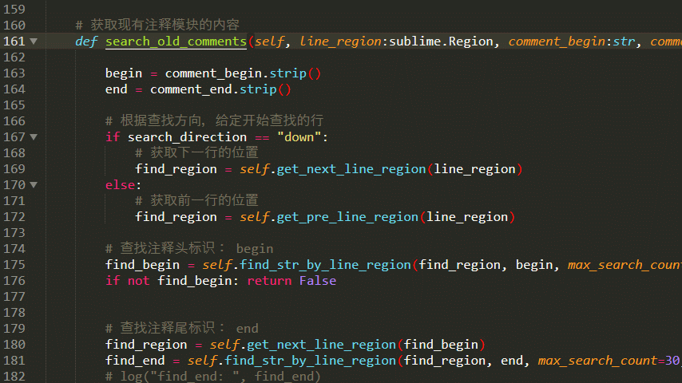
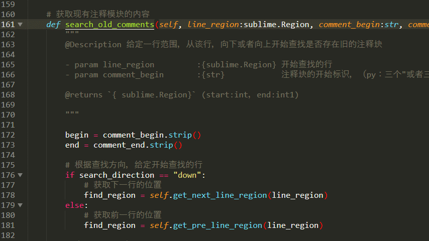

# 简介|Introductions

自用的注释模板注入插件，原理是采用正则匹配，当前不知道有ast语法树的时候写的，也没时间重构，就边用边更新了。

<div>
    
    
    
</div>

[English](README.en.md) | 简体中文


# 使用|Usage

快捷键：`Alt + q` 在函数行键入即可，暂时py使用比较多，js和ts部分语法不能识别，也没空更新

## **创建注释块**




## **更新注释块**




# **插件配置**

```json
// Packages/User/cps.sublime-settings
{
  "name": "tett 插件",
  "author": "CPS",
  "mail": "373704015@qq.com", //本插件任何问题请联系qq

  // prettier-ignore
  "cps_comments_creator": {
    // 全局默认配置
    "max_search_count":80,       // 搜索行数（正数从上向下查找， 负数反之）
    "params_alignment":"  ",     // [indent<string>] 是否对齐参数
    "comments_direction":"up",   // "down"|"up" 函数名字上一行，函数名字下一行
    "default_tmpl":{
      "comments_contexts":{
        "Description":true,
        "param":":param {type} {name} {description}",
        "returns":":returns {type} {description}",
      }
    },

    /* 根据后缀名设置 */
    "py": { 
      "comments_direction": "down",
      "comments_contexts":{
        "Description":"@Description {description}\n",
        "param":"- param {name} :{type} {description}",
        "returns":"\n@returns `{type}` {description}"
      },
      "comments_header": [
        "    \"\"\"",      // 注释区的开始标识
        "    ",            // 内容位置的前缀
        "    \"\"\"",      // 注释区的结束
      ]
    },

    "js":{ 
      "comments_contexts":{
        "Description":"@Description - {description}\n",
        "param":"@param {type} {name}  - {description}",
        "returns":"\n@returns {type} - {description}"
      },
      "comments_header": [
        "/**",        //    /**
        " * ",        //     * 内容位置的前缀
        " */"         //     */
      ]
    },

    "mjs":{
      "comments_contexts":{
        "Description":"@Description - {description}\n",
        "param":"@param {type} {name}  - {description}",
        "returns":"\n@returns {type} - {description}"
      },
      "comments_header": [
        "/**",        //    /**
        " * ",        //     * 内容位置的前缀
        " */"         //     */
      ]
    },

    "ts":{
      "comments_contexts":{
        "Description":"@Description - {description}\n",
        "param":"@param {type} {name}  - {description}",
        "returns":"\n@returns {type} - {description}"
      },
      "comments_header": [
        "/**",        // /**
        " * ",        //  * 内容位置的前缀
        " */"         //  */
      ]
    },

    "vue":{ 
      "comments_contexts":{
        "Description":" @Description {description}\n",
        "param":" @param {type} {name}  {description}",
        "returns":"\n @returns {type} {description}"
      },
      "comments_header": [
        "/**",      // /**
        " * ",      //  * @Description:
        " */"       //  */
      ]
    }
  }
  // prettier-ignore
}
```


# 联系方式|Contact

- **373704015 (qq、wechat、email)**
